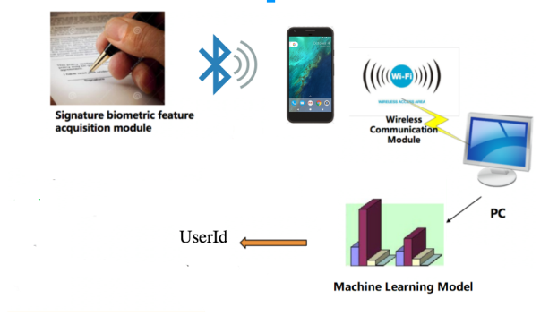

# Signature-Authentication-Pen

This responsory is for IOT project Signature Authentication Pen. A demo can be seen at https://youtu.be/xxnGFsNmaTY

## Introdution

In this project, we designed a Signature Authentication Pen, which realizes identity authentication by exploiting the signature biometric features of the users. Our Signature Authentication Pen collects the acceleration and angular velocity data when the user is writing, and build machine learning model for real time identity prediction. As the biometric features of writing is hard to imitate, our system is much safer compared with traditional identity authentication methods. Our project provides a new approach for identity authentication and has a broad application prospects in shopping, criminals recognition and smart home.

## System Architecture

The MetawearC collects acceleration and angular velocity. Attach MetawearC to a pen. The Android App can communicate with MetawearC by Bluetooth and send collected data to Web server. The Web server is deployed on AWS EC2 using Flask. After the server receives the original data, it first do data cleaning then feed the cleaned data into neural network. The neural network is designed using Keras. The output of the neural network will be sent back to our Android App for display.

## Flow Chart

## Hardware 

[MetawearC](https://mbientlab.com/product/metawearc/) 

## Software

### Data Cleaning

Resample (upsample / downsample)

Normalize

### Neural Network Architecture

Neural network is designed using Keras. Each of the layer is full-connected. Except the output layer, other layers use Relu as activation function. To avoid the problem of overfitting, we add dropout of 0.1 in the last two layers.

### Android App

As MetawearC transmit data by Bluetooth, We design an Android App utilizing the API from Metawear SDK. After the MetawearC is connected with the phone by Bluetooth, when clicking start button, the MetawearC starts collecting acceleration and angular velocity and save them into RAM. When clicking stop button, MetawearC stops collecting data and POST the data into server. The length of data will be displayed by Toasts. After receiving the response from the server, the App will display the result of prediction, namely, the name of the user in real time identity recognition mode or true/flase in fake signature distinguishing mode.

### Server

The server was built using Flask deployed on AWS EC2 for wireless device. In training mode, after receiving the posted data from Android App, the server do data cleaning first then store the cleaned data into a csv file. Then it reads the csv file and train the neural network. The trained weights will be stored into a file with hdf5 format. In testing mode, the neural network loads the trained weight of the network and make prediction for each received data. Then it responds the Android App with the result of prediction.

## Code description

### Prerequisites

Pyothon3

tensorflow: pip install tensorflow

Keras: pip install keras

Flask: pip install flask

Android studio

### Run the code

1. install the Android App on your phone

2. start the server:

go to directory server

for training: python3 server.py train

for predition: python3 server.py test

