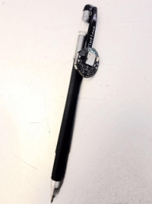
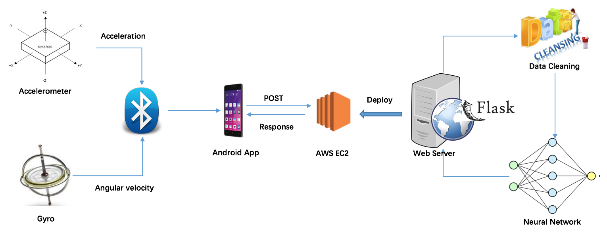
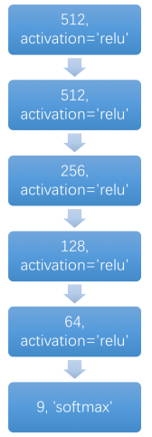

# Signature-Authentication-Pen

This responsory is for IOT project Signature Authentication Pen. A demo can be seen at https://youtu.be/xxnGFsNmaTY

## Introdution

In this project, we designed a Signature Authentication Pen, which realizes identity authentication by exploiting the signature biometric features of the users. Our Signature Authentication Pen collects the acceleration and angular velocity data when the user is writing, and build machine learning model for real time identity prediction. As the biometric features of writing is hard to imitate, our system is much safer compared with traditional identity authentication methods. Our project provides a new approach for identity authentication and has a broad application prospects in shopping, criminals recognition and smart home.

## System Architecture

The MetawearC collects acceleration and angular velocity. Attach MetawearC to a pen. The Android App can communicate with MetawearC by Bluetooth and send collected data to Web server. The Web server is deployed on AWS EC2 using Flask. After the server receives the original data, it first do data cleaning then feed the cleaned data into neural network. The neural network is designed using Keras. The output of the neural network will be sent back to our Android App for display.

## Hardware 

[MetawearC](https://mbientlab.com/product/metawearc/) 

## Software

### Data Cleaning

Resample (upsample / downsample)

Normalize

### Neural Network Architecture

Neural network is designed using Keras. Each of the layer is full-connected. Except the output layer, other layers use Relu as activation function. To avoid the problem of overfitting, we add dropout of 0.1 in the last two layers.

